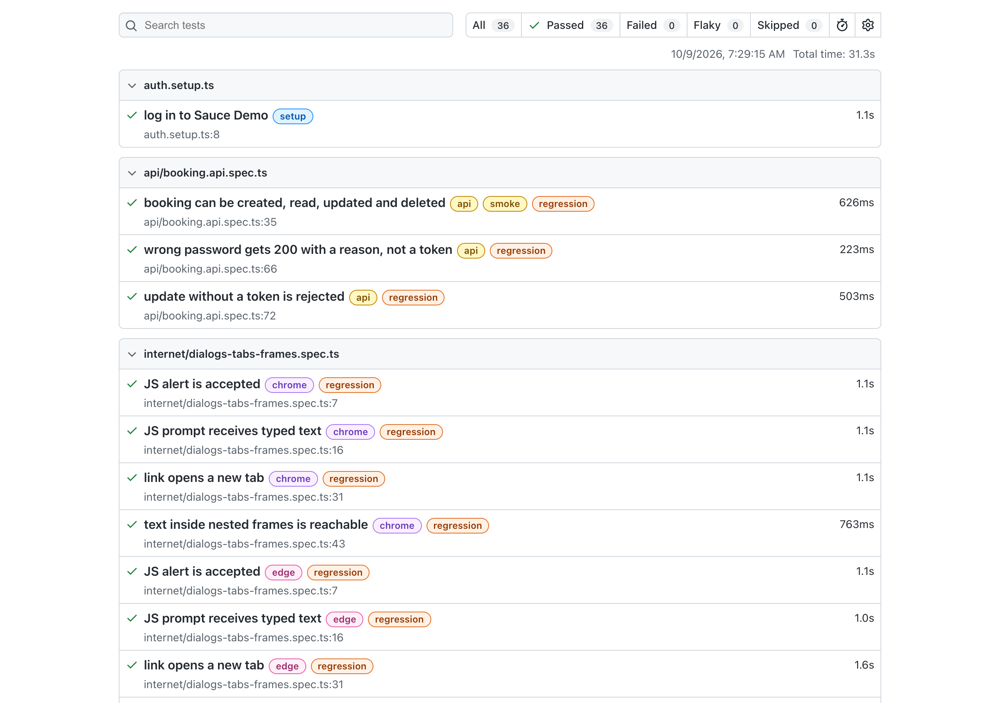
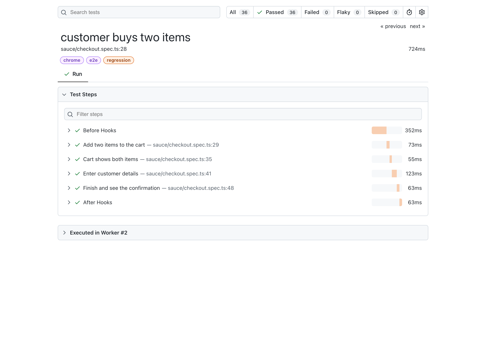

# Playwright TypeScript Sample

[](https://github.com/richardlizheng/playwright-typescript-sample/actions/workflows/playwright.yml)

UI and API tests for three public practice sites, written with Playwright and TypeScript.

> A personal sample project, built in October 2026, to show how I structure Playwright TypeScript tests.
> It is not client or employer work. It only targets public sites built for automation practice.

## What this repo shows

| Topic | Where |
|---|---|
| Setup from zero | [Quick start](#quick-start), [How I built this from zero](#how-i-built-this-from-zero) |
| Credentials and secrets | [`.env.example`](.env.example), [`utils/env.ts`](utils/env.ts), [workflow](.github/workflows/playwright.yml), [`docs/SECRETS.md`](docs/SECRETS.md) |
| Locators and verifying them | [`docs/LOCATORS.md`](docs/LOCATORS.md), [`pages/`](pages/) |
| Page objects and fixtures | [`pages/`](pages/), [`fixtures/test-fixtures.ts`](fixtures/test-fixtures.ts) |
| Data-driven tests | [`tests/sauce/login.spec.ts`](tests/sauce/login.spec.ts), [`test-data/login-cases.json`](test-data/login-cases.json) |
| End-to-end flow with steps | [`tests/sauce/checkout.spec.ts`](tests/sauce/checkout.spec.ts) |
| Dynamic content, no fixed waits | [`tests/internet/dynamic.spec.ts`](tests/internet/dynamic.spec.ts) |
| Pop-up that disappears after 30 s | [`tests/ui-patterns/toast.spec.ts`](tests/ui-patterns/toast.spec.ts) |
| Dialogs, new tabs, frames | [`tests/internet/dialogs-tabs-frames.spec.ts`](tests/internet/dialogs-tabs-frames.spec.ts) |
| Log in once, reuse the session | [`tests/auth.setup.ts`](tests/auth.setup.ts), [`playwright.config.ts`](playwright.config.ts) |
| API tests | [`tests/api/booking.api.spec.ts`](tests/api/booking.api.spec.ts) |
| Edge and Chrome | [`playwright.config.ts`](playwright.config.ts) |
| CI | [`.github/workflows/playwright.yml`](.github/workflows/playwright.yml) |
| Lint rules against flaky patterns | [`eslint.config.mjs`](eslint.config.mjs) |
| Repairing a broken suite | [`docs/REPAIR_PLAYBOOK.md`](docs/REPAIR_PLAYBOOK.md), [`scripts/triage-failures.ts`](scripts/triage-failures.ts), [`examples/before-after/`](examples/before-after/) |

## Quick start

Needs Node.js 22 or later.

```bash
git clone https://github.com/richardlizheng/playwright-typescript-sample.git && cd playwright-typescript-sample
npm ci && npx playwright install chrome msedge ffmpeg
cp .env.example .env    # fill in the empty values: see "Practice sites" at the end
npx playwright test
```

`ffmpeg` is needed to record video of failed tests. If Chrome or Edge is already installed,
Playwright prints a notice and keeps your installed browser.

| Script | What it does |
|---|---|
| `npm test` | All tests, all projects |
| `npm run test:headed` | Watch the browser |
| `npm run test:ui` | Playwright UI mode: pick locators, replay steps |
| `npm run test:smoke` | `@smoke` only (4 fast tests) |
| `npm run test:regression` | `@regression` (every test) |
| `npm run test:e2e` | `@e2e` (the checkout flow) |
| `npm run test:chrome` / `npm run test:edge` | One browser only |
| `npm run test:api` | API tests only |
| `npm run test:stability` | Every test 10 times (`--repeat-each=10`) |
| `npm run report` | Open the last HTML report |
| `npm run codegen` | Record actions and pick locators |
| `npm run lint` / `npm run typecheck` | ESLint / `tsc --noEmit` |
| `npm run triage` | Group failures in the last run by cause |

## How I built this from zero

1. Install Node.js, VS Code and the Playwright extension.
2. Run `npm init playwright@latest`.
3. Set the config: baseURL, reporters, retries, trace, Chrome and Edge projects.
4. Add folders: pages, tests, fixtures, utils.
5. Add `.env` and `.gitignore`.
6. Run a headed test, push to Git, add CI.

## Project structure

```
.github/workflows/playwright.yml   CI: lint, typecheck, tests on Chrome + Edge, report upload
docs/                              LOCATORS.md, SECRETS.md, REPAIR_PLAYBOOK.md
examples/before-after/             a brittle test and its fixed version (never run)
fixtures/test-fixtures.ts          `test` extended with page objects
pages/sauce/                       LoginPage, InventoryPage, CartPage, CheckoutPage
pages/internet/                    DynamicLoadingPage, DynamicControlsPage, ChallengingDomPage
scripts/triage-failures.ts         groups failures from reports/results.json
test-data/login-cases.json         usernames and expected errors (passwords come from env)
tests/auth.setup.ts                logs in once, saves .auth/user.json
tests/sauce/                       login (data-driven), cart and checkout
tests/internet/                    dynamic content, locators, dialogs / tabs / frames
tests/ui-patterns/toast.spec.ts    30-second toast checked with Playwright's clock
tests/api/booking.api.spec.ts      Restful Booker CRUD with a token
utils/env.ts                       reads env variables, fails fast if one is missing
utils/navigation.ts                openPage(): fails at once if the site returns an error page
playwright.config.ts               projects: setup, api, chrome, edge
```

Page objects do actions. Tests do assertions. The one exception is `expectLoaded()`, which checks that a page is open.

| Project | Runs | Notes |
|---|---|---|
| `setup` | `auth.setup.ts` | Runs first. Logs in to Sauce Demo once. |
| `chrome` | all UI tests | `channel: 'chrome'`, starts logged in |
| `edge` | all UI tests | `channel: 'msedge'`, starts logged in |
| `api` | `*.api.spec.ts` | No browser, so it runs once instead of once per browser |

## Locator strategy

Order of preference: `getByRole` with `name` → `getByLabel` → `getByText` / `getByPlaceholder` → `getByTestId` → CSS → XPath (never absolute).

How I verify a locator before I trust it:

1. DevTools → Elements → **Accessibility** tab: read the computed role and name.
2. `npx playwright codegen <url>` → *Pick locator*.
3. `npx playwright test --ui` → *Pick locator*, step-by-step replay, DOM snapshot.
4. `PWDEBUG=console npx playwright test` → `playwright.$(...)` and `playwright.locator(...)` in the browser console.
5. Strictness: if a locator matches 2+ elements, the action fails. Make it more specific.

ESLint blocks `waitForTimeout`, `force: true`, `page.$` and absolute XPath. Details: [docs/LOCATORS.md](docs/LOCATORS.md).

## Credentials and secrets

- Locally, values live in `.env`, which is git-ignored. Only [`.env.example`](.env.example) (placeholders) is committed.
- Code reads every value through [`utils/env.ts`](utils/env.ts). No URL or password appears in a test or page object.
- A missing value stops the run with `Missing env variable NAME. Copy .env.example to .env and fill it in.`
- In CI, credentials are GitHub Actions **secrets**, and URLs are repository **variables**.
- `.auth/user.json` holds a live session cookie, so it is git-ignored too.

These sites publish their practice credentials. I still keep them in `.env` and CI secrets to show the pattern.
Jenkins and Azure DevOps versions: [docs/SECRETS.md](docs/SECRETS.md).

## Running in CI

The workflow runs on every push to `main`, on pull requests, and on demand:
`npm ci` → lint → typecheck → install Chrome and Edge → run all projects → upload the HTML report (kept 14 days).

Setup on GitHub: *Settings → Secrets and variables → Actions*.

| Secrets | Variables |
|---|---|
| `SAUCE_USER`, `SAUCE_PASSWORD`, `BOOKER_USER`, `BOOKER_PASSWORD` | `SAUCE_BASE_URL`, `INTERNET_BASE_URL`, `BOOKER_API_URL` |

There are 2 workers (local and CI). CI also uses 2 retries. Traces are kept on the first retry, and screenshots and video on failure.
If any test fails, `npm run triage` prints a summary of the failures by cause in the job log.

HTML report from a local run:



The checkout test in the report. Each `test.step()` reads like a line in a manual test case:



## Practice sites used

| Site | Used for | Published demo credentials |
|---|---|---|
| [Sauce Demo](https://www.saucedemo.com) | Login, cart, checkout | `standard_user` / `secret_sauce` (shown on the login page) |
| [The Internet](https://the-internet.herokuapp.com) | Dynamic content, tricky locators, dialogs, tabs, frames | none needed |
| [Restful Booker](https://restful-booker.herokuapp.com/apidoc/index.html) | API tests | `admin` / `password123` (in the API docs) |

These are shared public sites, so every run uses only 2 workers and there are no load tests.

Two settings exist because of The Internet's hosting, and both have comments in the code.
Its server sometimes stalls for 30 seconds when a browser loads many files over one HTTP/2 connection.
So the Chrome and Edge projects use HTTP/1.1 ([`playwright.config.ts`](playwright.config.ts)),
and the fixtures block analytics and unused libraries ([`fixtures/test-fixtures.ts`](fixtures/test-fixtures.ts)).

## License

[MIT](LICENSE)
